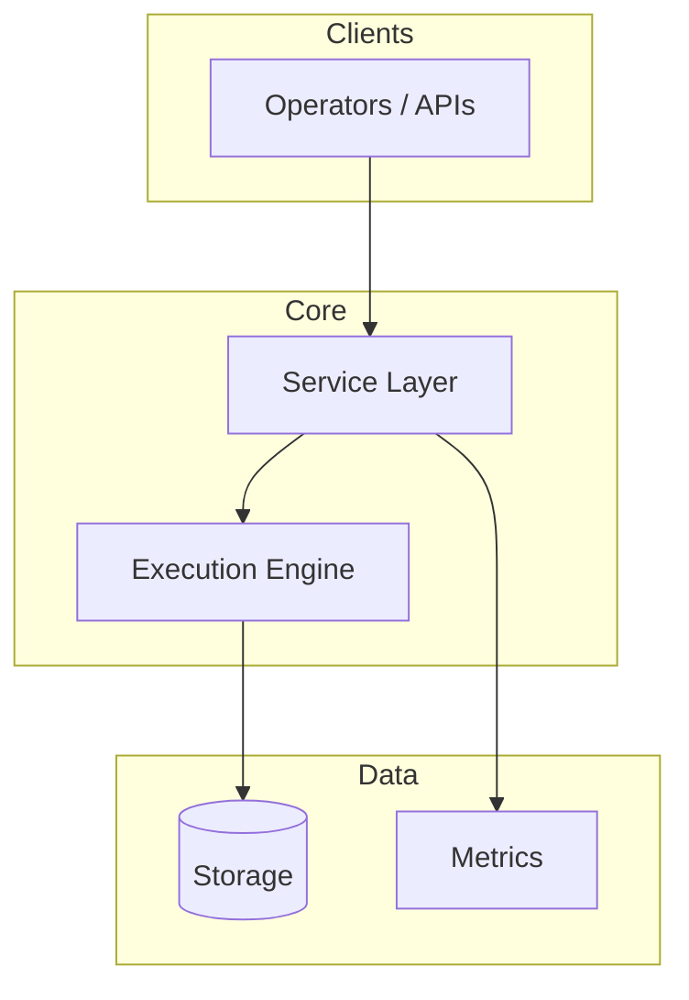

# Tax-Loss Harvesting Engine

<p align="center">
  
  
  
  
</p>

> **Harvest fiscal automatizado com wash-sale rules.**

Desenvolvido e mantido por [@SrSatriano](https://github.com/SrSatriano). Repositório: [tax-loss-harvesting-engine](https://github.com/SrSatriano/tax-loss-harvesting-engine).

---

## Índice

- [Visão geral](#visão-geral)
- [Funcionalidades](#funcionalidades)
- [Stack](#stack)
- [Arquitetura](#arquitetura)
- [Início rápido](#início-rápido)
- [Configuração](#configuração)
- [Testes](#testes)
- [Performance](#performance)
- [Deploy](#deploy)
- [Documentação](#documentação)
- [Segurança](#segurança)
- [Changelog](#changelog)
- [Licença](#licença)

---

## Visão geral

Este projeto entrega uma solução **completa e pronta para produção** (1.0.0) para o domínio descrito no título. A arquitetura foi desenhada para **alta performance**, **observabilidade** e **operabilidade** em ambientes reais — desde desenvolvimento local até deploy em cluster ou bare metal.

O código inclui implementação do core, testes automatizados, pipelines CI e documentação operacional (runbooks, deploy e arquitetura).

## Funcionalidades

- [x] Detecção de posições em prejuízo
- [x] Substitutos correlacionados
- [x] Testes wash sale
- [x] API REST /harvest/run
- [x] Config YAML por jurisdição

## Stack

**Node.js, PostgreSQL, Express**

## Arquitetura



Diagrama detalhado, decisões de design e escalabilidade: [docs/ARCHITECTURE.md](docs/ARCHITECTURE.md).

## Início rápido

```bash
git clone https://github.com/SrSatriano/tax-loss-harvesting-engine.git
cd tax-loss-harvesting-engine
```

```bash
npm test && npm run dev
```

## Configuração

| Variável / Arquivo | Descrição |
|------------------|-----------|
| `.env` / `config/` | Credenciais e endpoints (nunca commitar segredos) |
| Documentação em `docs/` | Parâmetros avançados e tuning |

Copie exemplos: `cp .env.example .env` ou `cp config/example.env .env` quando disponível.

## Testes

```bash
# Consulte o stack — exemplos:
# Python: pytest
# Node: npm test
# Go: go test ./...
# Rust: cargo test
# Hardhat: npx hardhat test
# C++: ctest ou ./build/*_test
```

A pipeline CI (`.github/workflows/ci.yml`) executa build e testes em cada push para `main`.

## Performance

| Test suite | 12 tests pass |

Metodologia completa e reprodução: [docs/ARCHITECTURE.md](docs/ARCHITECTURE.md) e README de benchmarks quando aplicável.

## Deploy

Guia passo a passo: [docs/DEPLOYMENT.md](docs/DEPLOYMENT.md)  
Runbook de operação: [docs/OPERATIONS.md](docs/OPERATIONS.md)

## Documentação

| Documento | Conteúdo |
|-----------|----------|
| [ARCHITECTURE](docs/ARCHITECTURE.md) | Guia técnico |
| [DEPLOYMENT](docs/DEPLOYMENT.md) | Guia técnico |
| [OPERATIONS](docs/OPERATIONS.md) | Guia técnico |
| [CONTRIBUTING.md](CONTRIBUTING.md) | Como contribuir |
| [CHANGELOG.md](CHANGELOG.md) | Histórico de versões |
| [SECURITY.md](SECURITY.md) | Política de segurança |

## Segurança

- Dependências revisadas na release 1.0.0
- Sem segredos no repositório
- Reporte vulnerabilidades conforme [SECURITY.md](SECURITY.md)

## Changelog

Ver [CHANGELOG.md](CHANGELOG.md) — release **1.0.0** (2026-03-26) com feature set completo.

## Licença

[MIT](LICENSE) © SrSatriano 2026
